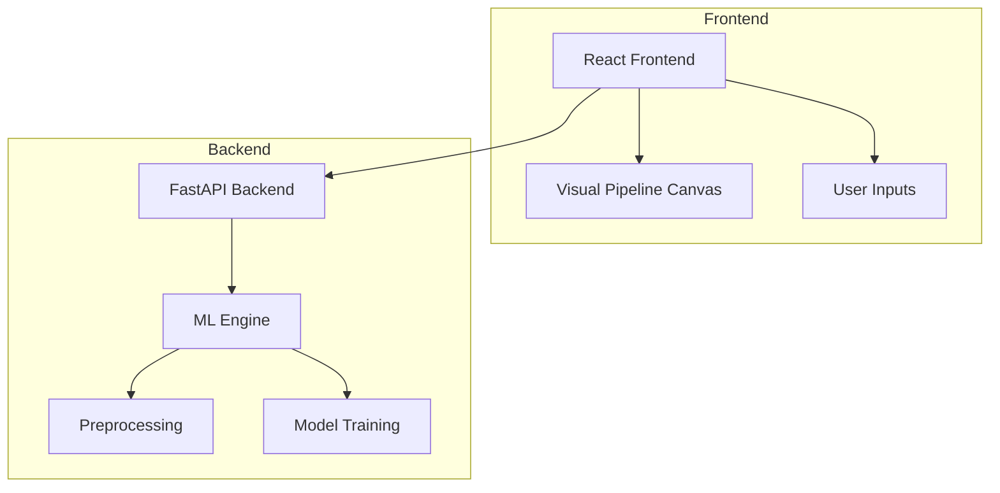

# ML Analytics Pipeline  
### No-Code Machine Learning Pipeline Builder

ML Analytics Pipeline is a **full-stack, no-code machine learning pipeline builder** that enables users to:

- Visually construct ML workflows in the frontend  
- Ingest tabular data  
- Preprocess, train, and evaluate models  
- Execute pipelines without writing code  
- Deploy ML models via a backend API  

The project clearly separates **frontend UI, backend orchestration, and ML execution**, enabling real-world experimentation and workflow automation.

---

## 📌 Problem Statement

Building machine learning pipelines typically requires:

- Manual coding of data preprocessing  
- Model training and evaluation scripts  
- Orchestration of sequential processing steps  
- Deployment infrastructure  
- Coordination between ML, DevOps, and product teams  

This complexity slows experimentation and excludes non-engineers.

**ML Analytics Pipeline solves this by enabling visual pipeline construction with backend execution**, making ML workflows accessible while preserving scalability and structure.

---

## 🎯 Key Objectives

- Provide a **visual interface** for building ML workflows  
- Decouple **frontend UI** from **backend orchestration**  
- Automate preprocessing → training → evaluation  
- Enable drag-and-drop configuration  
- Support rapid ML experimentation  

---

## 🧠 Features Implemented

- Visual drag-and-drop pipeline builder  
- CSV / Excel dataset ingestion  
- Preprocessing options (StandardScaler, MinMaxScaler)  
- Training for classical ML algorithms  
- Backend orchestration via API  
- Modular, extensible architecture  

---

## 🏗️ System Architecture



## 🔄 Request Flow

1. User constructs a pipeline via drag-and-drop in the UI  
2. Frontend sends pipeline configuration and dataset to the backend  
3. Backend orchestrates preprocessing steps  
4. Selected ML model is trained  
5. Evaluation metrics are computed  
6. Results are returned and visualized in the UI  

---

## 🧩 Core Components

### 🖥 Frontend (React)

- Built using **React.js + React Flow**  
- Drag-and-drop pipeline construction  
- Dataset upload handling  
- Configuration of preprocessing and model nodes  

---

### ⚙️ Backend (FastAPI)

- REST API for pipeline execution  
- Receives pipeline definitions from frontend  
- Orchestrates preprocessing, training, and evaluation  
- Returns metrics and execution results  

---

### 🤖 ML Engine (Python)

Handles:
- Data scaling  
- Model training  
- Performance evaluation  

Supported models include:
- Logistic Regression  
- Decision Tree  
- Other classical ML algorithms  

---

## ⚙️ Technology Stack

| Layer | Technology |
|------|------------|
| Frontend | React.js, React Flow |
| Backend API | FastAPI (Python) |
| Machine Learning | scikit-learn, Pandas |
| Deployment | Python environment |
| UI | HTML, CSS, JavaScript |

---

## 🛠️ Installation & Setup

### 1️⃣ Clone the Repository

```bash
git clone https://github.com/srikrishnakoushik/ml-analytics-pipeline.git
cd ml-analytics-pipeline
````

---

### 2️⃣ Setup Backend

```bash
cd backend
pip install -r requirements.txt
```

Start the backend server:

```bash
uvicorn main:app --reload
```

---

### 3️⃣ Setup Frontend

```bash
cd frontend
npm install
npm start
```

Frontend will run on:

```text
http://localhost:3000
```

---

## 🚀 How to Use

1. Upload a CSV or Excel dataset
2. Drag preprocessing blocks onto the canvas
3. Select an ML model and hyperparameters
4. Execute the pipeline
5. View metrics and results

This enables **rapid ML prototyping without manual coding**.

---

## 📊 Metrics & Visualization

The UI displays:

* Model accuracy
* Confusion matrix
* Preprocessing summary
* Training duration

---

## ⚠️ Limitations

* Limited number of supported ML algorithms
* No persistent storage (database)
* Basic error handling
* No user authentication

---

## 🗺️ Future Enhancements

* Support for additional ML models
* Hyperparameter tuning
* Persistent storage for datasets and runs
* Authentication and user accounts
* Export and deployment of trained models

---

## 🎯 What This Project Demonstrates

* Full-stack separation: frontend, backend, and ML engine
* Visual workflow orchestration
* Practical ML pipeline automation
* No-code experimentation with structured execution

---

## 📄 License

MIT License


